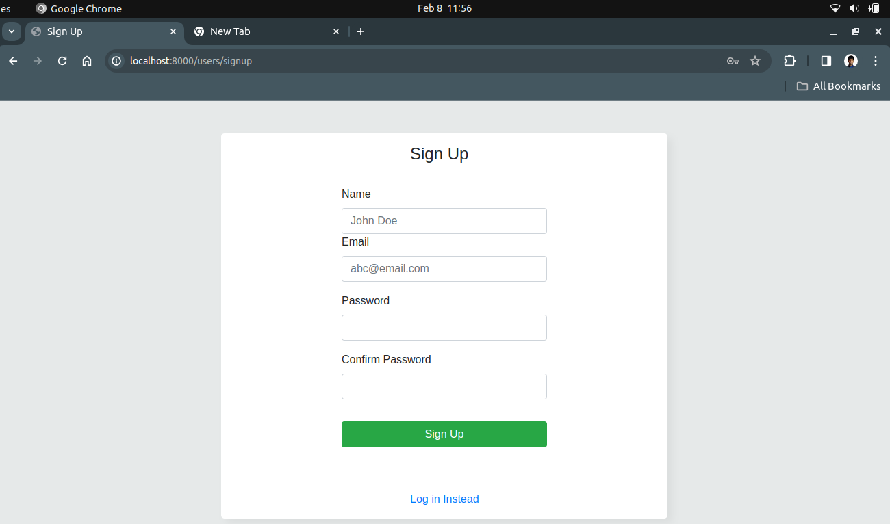
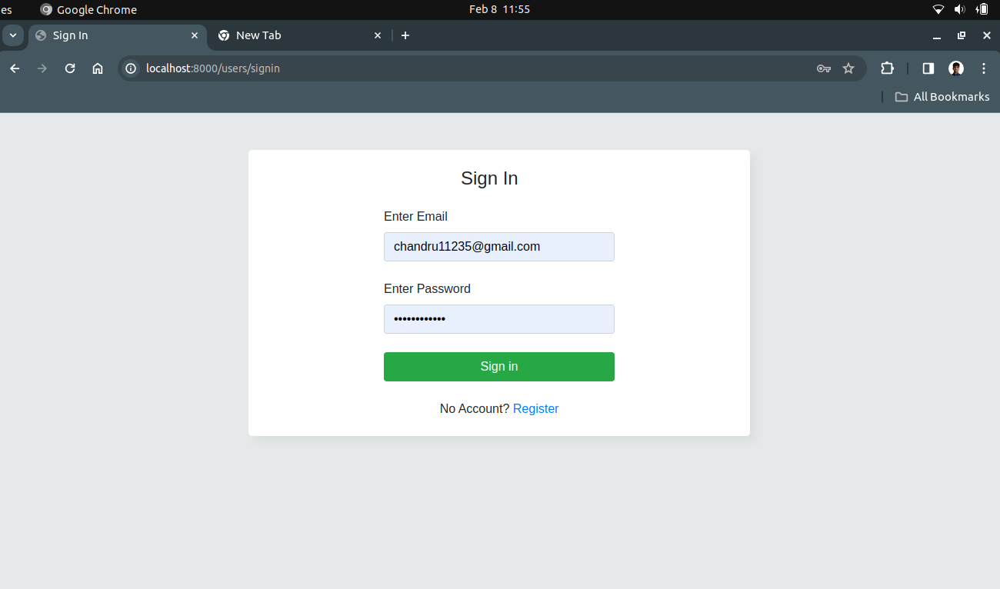
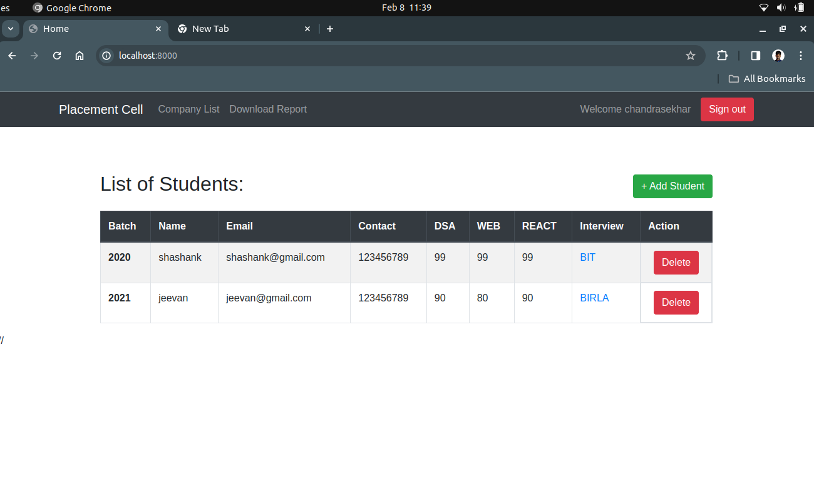
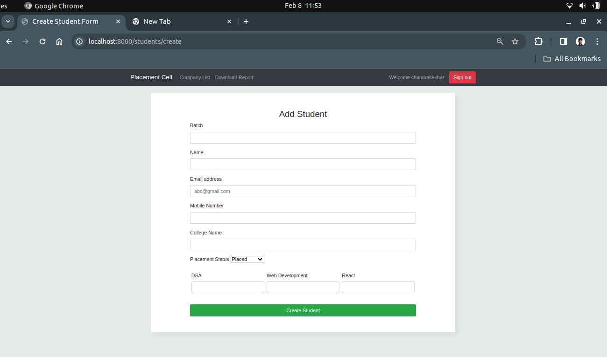
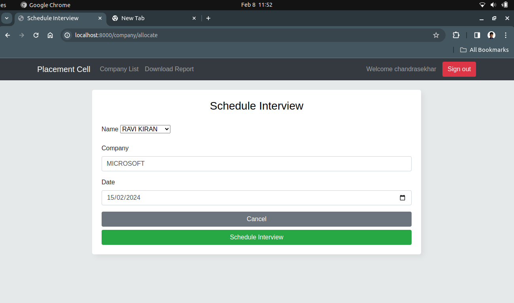

# NodeJS-Placement-Cell

 <h1 align="center">Placement Cell  📝</h1>

 <p >
 
 
 An interface for coding ninjas placement cell to keep records of students and schedule interviews with different companies <br>
     This App built using <a href="https://ejs.co/">EJS</a>, <a href="https://www.mongodb.com/">MongoDB</a>, <a href="https://expressjs.com/">ExpressJs</a>, <a href="https://nodejs.org/en/">NodeJs</a> and <a href="http://www.passportjs.org/">PassportJS</a>
</p>

## Tech Stack

**Client:** `HTML`, `CSS`, `JAVASCRIPT`

**Server:** `Node.js, Express.js, Mongoose, EJS,

## 🔗 Links

Github Link:- https://github.com/atulsanini7900/PlacementCellApp.git

## 🔗 Live Demo

Render Link:- https://placement-cell-app-kxhc.onrender.com

## Features

- Sign up / Sign in forms for employees
- Add a new student to the list of students
- Allocate and schedule interview with different companies and update their result status
- Download reports of students in csv format

  ## Folder Structure

```
Placement-Cell/

├── routes/
│   ├── companyRoute.js
│   ├── userRoute.js
│   ├── studentRoute.js
│   ├── index.js
|   |
├── controllers/
│   ├── companyController.js
│   ├── homeController.js
│   ├── studentController.js
│   ├── userController.js
|   |
├── models/
│   ├── companySchema.js
│   ├── userSchema.js
│   ├── studentSchema.js
|   |
├── views/
│   ├── sinup.ejs
│   ├── signin.ejs
│   ├── home.ejs
│   ├── company.ejs
│   ├── allocationinterview.ejs
│   ├── add_student.ejs
|   ├── _header.ejs
|   ├── _bootstrap_script.ejs
|   ├── _bootstrap_meta.ejs
├── .gitignore
├── index.js
├── package-lock.json
├── package.json
├── README.md
```

## Screenshots

- Sign Up
  

- Sign In
  

- Student Page
  

- Interview Page
  

- Add student
  

- Schedule Interview
  

## Setup

setting up the Placement Cell app, a web-based tool crafted to oversee placement-related tasks within an institution. The application comprises a client-side built with HTML, CSS, and JavaScript, and a server-side developed using Node.js, Express.js, and Mongoose. Furthermore, EJS serves as the templating engine for server-side rendering in this application.

### Prerequisites:

Node.js and npm installed on your system.

### Step 1: Clone the Repository

Open your terminal or command prompt.
Use the git clone command to clone the repository to your local machine.
bash

`git clone <repository_url>`

### Step 2: install

Install the required Node.js packages by running the following command.

`npm install`

Set up the MongoDB database using Mongoose. Modify the config.js file in the config directory with your MongoDB connection URL.
Create necessary models for the placement cell app in the models directory using Mongoose schema.
Implement the required routes and logic in the routes directory to handle placement cell functionalities like adding, updating, and deleting placements.

### Step 3: EJS Templating

In the server directory, navigate to the views folder.
Customize the EJS templates to render dynamic content and data from the server.
Ensure that the templates are correctly integrated with the routes to display the data as intended.

### Step 4: Start the Application

Run the following command to start the server.

`node app.js`

### Step 6: Access the Application

Open your web browser and visit http://localhost:8000 to access the Placement Cell web app.
